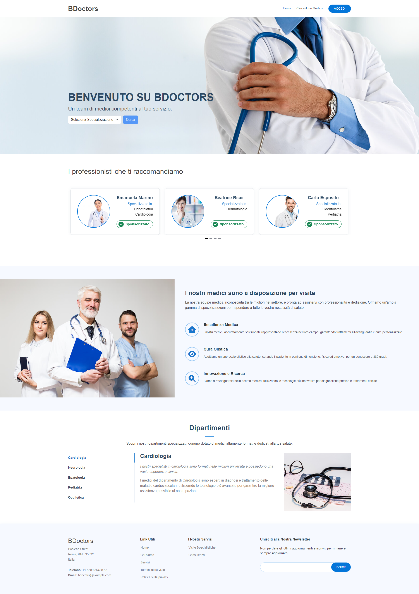

# Cos'è BDoctors?

BDoctors è un sito web innovativo che permette ai suoi utenti di cercare i medici per specializzazione, dando la possibilità di applicare ulteriori filtri, ordinarli per numero di recensioni e per numero di stelle. 
Selezionando il dottore, si possono visionare i suoi dati e, attraverso un form, può essere contattato e recensito.

Se sei un medico, registrarti su Bdoctors ti permetterà di farti trovare da pazienti ovunque ti trovi, di gestire dinamicamente tutti i tuoi dati, controllare i messaggi e le recensioni degli utenti e analizzare le statistiche mensili e annuali dei tuoi dati!
Inoltre, se vuoi aumentare la tua visibilità nelle ricerche e apparire nella homepage del nostro sito, considera di acquistare uno dei nostri piani di sponsorizzazione.

# Cosa significa per noi BDoctors?

BDoctors è il nostro progetto finale del corso di Boolean Carrers che dimostra le nostre competenze da Jr-Full-Stack Web Developer.
Durante le tre intense settimane della realizzazione del progetto abbimo messo in gioco le nostre competenze imparate nel corso, abbiamo  imparato a documentarci e implementare nuove feature nei progetti e  lavorare come un vero team di sviluppo, dividendo il nostro lavoro in milestone.
Ogni 4 giorni abbiamo presentato tutte le feature inserite nel progetto ai nostri cooridinatori, valutando tutti gli edge-cases e adattando la grafica per essere il user-friendly possibile 


## Sviluppato da...

- Mekki Ouertani [Github](https://github.com/mekkiouertani) [Linkedin](https://www.linkedin.com/in/mekkiouertani/)

- Simone Negrisoli [Github](https://github.com/SimoneNegrisoli) [Linkedin](https://www.linkedin.com/in/simonenegrisoli/)

- Alberto Stizzoli [Github](https://github.com/albertostizzoli) [Linkedin](https://www.linkedin.com/in/alberto-stizzoli-82a676260/)

- Stefano Zidda [Github](https://github.com/Trotteriniku) [Linkedin](https://www.linkedin.com/in/stefano-zidda-357aba2b1/)

- Luca Masera [Github](https://github.com/luca-masera) [Linkedin](https://www.linkedin.com/in/luca-masera-a67ab52b1/)

- Francesco Carrara [Github](https://github.com/fcarrara24) [Linkedin](https://www.linkedin.com/in/francesco-carrara-4b7a642ab/)

## Tecnologie usate

+ Laravel 10.0

+ Vue 3.x

+ Bootstrap 5.x

+ GitHub

+ My-SQL

+ Braintree

+ Carbon

## Installazione

Il progetto utilizza doppia tecnologia: [Vue.js](https://github.com/mekkiouertani/vue-bdoctors) e [Laravel](https://github.com/Trotteriniku/laravel-bdoctors)
 con MySql Link Repo Back-office Link Repo Front-office 

### Back-Office (Laravel): 
+  clonare repo da GitHub copiare il file .env-example e rinominarlo in .env, 
+  aggiornare alcuni dati come quello del Db lanciare i seguenti comandi 

```bash
composer install 
npm install 
php artisan storage:link 
php artisan migrate
php artisan db:seed 
```
+ per lanciare il server aprire 3 terminali e lanciare: 

```bash
php -S localhost:8000 -t public 
npm run dev 
php artisan queue:work 
```

### Front-Office (Vue.js)
+ clonare repo da GitHub 
 ```bash
 npm install 
 ```
+ e dopo lanciare il server con il comando 
 ```bash
 npm run dev
 ```
